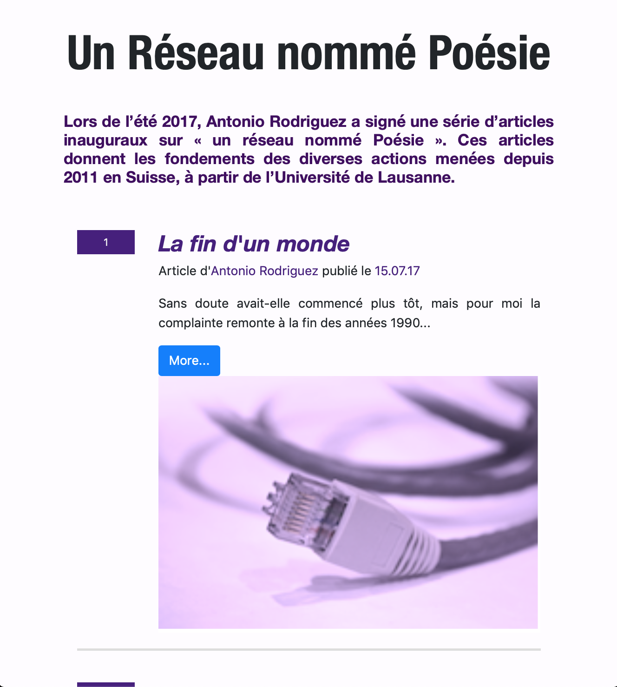
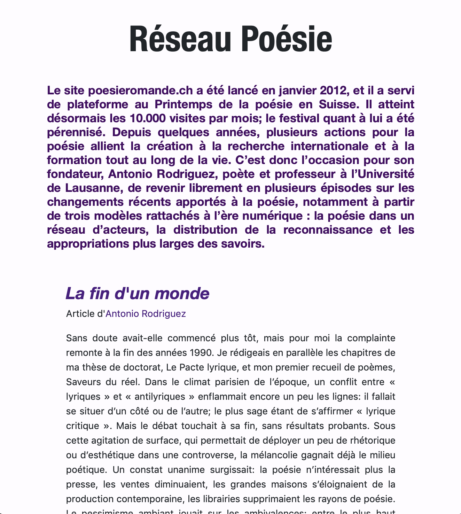
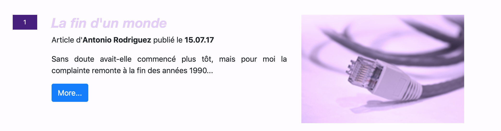
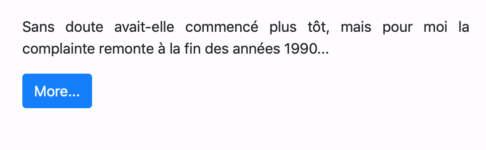

<h1><align center>Projet Un réseau nommé poésie</align center</h1>

<h2> Description du projet </h2>

<strong>Ce travail vise à améliorer, de manière esthétique et pratique, les articles publiés par A. Rodriguez sur poésieromande.ch au sujet du Réseau nommé poésie : http://www.poesieromande.ch/wordpress/reseau-poesie/.</strong>
 Le but initial du projet n’était alors pas d’enrichir sémantiquement le texte, mais de travailler sur sa possible meilleure lecture pour tout utilisateur à travers le point focal qu’est l’ipad –le texte reste lisible sur tout type de média. Ayant tenté de rendre le texte plus attrayant et facile à lire sur une page HTML par le biais de l’utilisation du CSS, de polices téléchargées et de plugins, nous avons décidé de présenter les 10 articles à travers 10 parties, avec un titre, le début de l’article, une photos animée, et un lien qui renvoie à l’article en entier ; ensuite, l’article en entier s’affiche de manière épurée et agréable à lire. 
Le projet se trouve à ces pages :
-  https://github.com/melinamarchetti/publication-num-rique.git
-   https://melinamarchetti.000webhostapp.com

<h2>Fonctionnalités du projet</h2>

Pour présenter notre travail, nous avons joint les fichiers suivants dans le dossier github "publication /travail/images/travail" :<ol>
-	<strong>Le fichier principal HTML</strong>, nommé « index », qui renvoie à la page produite s’affichant sur le navigateur. Il est composé de trois parties : 1) un titre 2) un résumé contextuel sur les articles 3) les 10 articles, tous composés d’une titre, du rédacteur et de la date de la parution, du début de l’article, et d’une photo animée. La lecture en deux étapes favorise, selon nous, l’intérêt du lecteur et pousse à scinder sa lecture en plusieurs étapes – donc de finir le texte.
 
  
-	<strong>Les fichiers secondaires HTML</strong>, nommés posts, qui contiennent les 10 fichiers sur lesquels ouvrent les liens. Ceux-ci sont composés d’un titre, d’un résumé, du texte, d’une image et de la référence du texte.
 
  
-	<strong>Un dossier CSS</strong>, qui contient un fichier au format CSS qui gère le style du document HTML. Soulignons que nous avons pensé au style général dans l'optique de rendre la lecture plus agréable : un fond clair et un texte foncé, une couleur violette esthétique ; des marges larges ; un interligne important ; une taille de police facilitant la lecture et des variations sur les tailles présentes mais pas trop conséquentes afin de ne pas saturer le lecteur. 
-	<strong>Un dossier de polices</strong>, qui touche lui aux polices téléchargées pour le travail. Les polices sélectionnées – accompagnées d’un interligne et de marges conséquentes - permettent, selon nous, une lecture plaisante. 
-	<strong>Un dossier image</strong>, regroupant les images de notre support (elles proviennent du site poésieromande.ch).  
 
 

Souhaitant faciliter l’acte de lecture des articles tout en développant un design épuré davantage esthétique, nous avons intégré les éléments et fonctionnalités suivantes: 
-	<strong>un scrolling letter</strong>, pour que le lecteur sache quand son acte de lecture se termine (cela constitue une motivation de lecture). 
-	<strong>une mise en page plus intéressante esthétiquement et qui rend la lecture meilleure</strong>, en accentuant un numéro plus visible ; en travaillant le choix d’une police (Helvetica Neue), ses diverses tailles et ses couleurs (noir et violets); en choisissant un corps de texte général avec alignement justifié à 13px; en optant pour un saut de ligne tous les 50 signes environ ; en ajoutant des marges de chaque côté du texte (width 85% et des margin 30px); en proposant un résumé pour chaque article avant ouverture ; et en agrandissant les photos.  
-	<strong>Un changement de page</strong> en cliquant sur le titre ou le more pour l'aller de la page principale à la page secondaire ; et le titre pour le retour des pages secondaires à la page principale.  
 
 
-	<strong>Des images animées</strong>: l'image bouge quelque peu lorsque l'on place le curseur sur celle-ci. 
-	<strong>Une lecture possible</strong> de la page html sur toute forme de média grâce au responsive (ipad, natel, ordinateur). 

Vu que le lieu de lecture idéal est l'ipad,la publication la plus intéressante se présente comme suit: 

 <h2> Auteur du projet</h2>
Ce travail a été réalisé par <strong>Melina Marchetti</strong> dans le cadre de sa spécialisation de Master en pédagogie et médiation culturelle, à l’occasion du cours <strong>« Publication numérique »</strong> dispensé par I. Pante à l’Unil en 2017.
